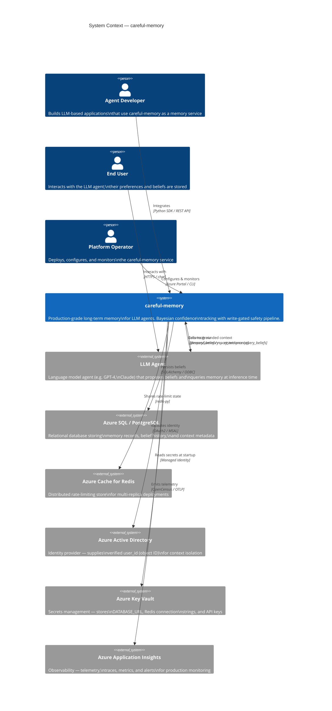

# C1: System Context Diagram

This diagram shows careful-memory within its broader operational environment — the external actors and systems it interacts with.

## Diagram

## Key Relationships

### LLM Agent ↔ careful-memory

The agent interacts exclusively through a **3-tool API**:

| Tool | Direction | Purpose |
|------|-----------|---------|
| `propose_belief` | Agent → Memory | Propose a new Subject-Predicate-Object belief |
| `report_evidence` | Agent → Memory | Report supporting or contradicting evidence |
| `query_beliefs` | Agent → Memory | Retrieve confidence-weighted memory summary |

The agent **cannot** directly write to the database, modify confidence values, or access another user's context.

### Platform Operator

The operator configures the service through environment variables (sourced from Azure Key Vault) and monitors it through Azure Application Insights. The operator never directly interacts with individual memory records.

### End User

The end user's identity (Azure AD object ID) is the root of context isolation. The user never interacts with careful-memory directly — only through their LLM agent session.

## Security Boundary

The careful-memory service is the **sole trust boundary** between LLM agents and the persistent memory store. All agent requests are subject to:

1. **Authentication** — bearer token validated against Azure AD (ADR-0014)
2. **Rate limiting** — distributed counter in Redis (ADR-0013)
3. **Write-gate rules** — authority, context isolation, outlier detection
4. **Reviewer judgment** — duplication, mass contradiction, policy

No agent request can bypass any of these layers.

## Related Documents

- [C2: Container Diagram](container-diagram.md)
- [ADR-0004](../adr/0004-context-isolation-via-contextscope.md): Context Isolation via ContextScope
- [ADR-0013](../adr/0013-distributed-rate-limiting.md): Distributed Rate Limiting
- [ADR-0014](../adr/0014-context-ownership-validation.md): Context Ownership Validation
